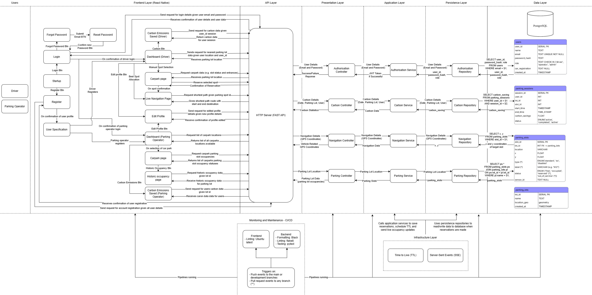

# ParkPilot
A parking mobile app in Python and React Native enabling drivers to reserve and navigate to available parking spots.
 


https://github.com/user-attachments/assets/e0f56379-a2f9-450f-b2fd-c36d8a4a27fd


https://github.com/user-attachments/assets/6c2c7796-c91a-4dc0-a70a-2d9dc0bc12af


## Motivation
Inefficient parking allocation in large densely populated cities is a significant problem. Of the 460,000 vehicles that enter Sydney’s CBD every day, 30-50% are engaged in searching for parking at any given time. These vehicles contribute to 30% of downtown traffic congestion, resulting in 150,000 hours wasted and millions lost in fuel and productivity every year.

## Quick Start
### Requirements
- Expo (mobile app)
- Node: v18.20.4
- Npm: v10.9.3

1. Create and activate a virtual environment

```bash
python3 -m venv venv
source venv/bin/activate        # macOS / Linux
```
2. Start backend (Terminal 1)

```bash
cd backend
pip install -r requirements.txt
uvicorn main:app --host 0.0.0.0 --port 8000 --reload
```

3. Start frontend (Terminal 2)
```bash
cd frontend
npm install
npx expo start
```

## Usage
Features:
- Authentication
- Navigation
- Visualise carbon savings
- Historical occupancy (Parking Operator only)

#### UML Diagram

[Edit the diagram](./docs/diagram.drawio)

## Contributing
### Clone the repo

```bash
git clone https://github.com/unsw-cse-comp99-3900/capstone-project-25t3-3900-f11a-date.git
cd capstone-project-25t3-3900-f11a-date
```

### Run the test suite

```bash
pytest
```

### Submit a pull request

If you'd like to contribute, please fork the repository and open a pull request to the `main` branch.

## Help
### Installing node and npm versions
1. Can get nvm or just download the node version 18.20.4. (nvm allows you to switch easily between node versions using 'nvm use 18.20.4') https://www.freecodecamp.org/news/node-version-manager-nvm-install-guide/
2. npm install -g npm@10.9.3


### Common things to watch out for
1. If you find that the frontend is not communicating with the backend (Login and Register are not taking you to the dashboard after pressing the button), check that the fetch url in the login and register screens match that in you frontend terminal (Underneath the QR code)


